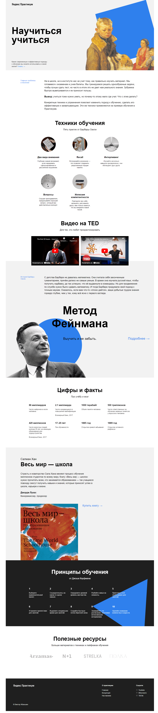

# Выполнение проекта - Научиться учиться.

Работа представляет собой одностраничный сайт, который рассказывает о новых подходах в обучении.

Страница создана для отработки навыков верстки. При создании были использованы анимации, флексбокс-вёрстка, правила БЭМ.

Была проведена работа по разбивке стилей по соответствующим папкам
- создана файловая структура по БЭМ (Nested).

В процессе работы выполнялась работа:
* с позиционированием объектов;
* с анимацией изображений через @keyframes;
* с изменением прозрачности ссылок при наведении на них курсора;
* вставка видео с использованием iframe;
* по внешнему виду в целом согласно брифу и макету.
Создание сеток производилось с использованием flex свойств.

**[Результат выполненной проектной работы](https://sibisov-artem.github.io/how-to-learn/)** 

